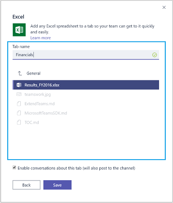

# Create the configuration page for your Microsoft Teams (Preview) tab

The configuration page is an HTML page that you host. Microsoft Teams displays it inside the **Add Tab** dialog when a user chooses to add your tab. This page enables you to present options and gather information from the user so they can specify the content, and customize the experience, which you present in your tab. For example, you may allow the user to select existing app resources (such as files or task lists), or create new such resources, for display in the tab.

When the user chooses to add your tab to their team, Microsoft Teams displays your configuration page, hosted within an iframe in a dialog box. The configuration page communicates with Microsoft Teams through the [Microsoft Teams Tab library](https://statics.teams.microsoft.com/sdk/v0.2/js/MicrosoftTeams.js).



## Configuration page example

The excerpt below shows a simple example of code that might be included in a configuration page.

 In this case, the user is presented with two radio buttons, which represent a choice of two different resources. Selecting either radio button fires `onClick()`, which sets `microsoftTeams.settings.setValidityState(true)`, enabling the **Save** button.

On save, the code determines which radio button was checked, and sets the various parameters of `microsoftTeams.settings.setSettings` accordingly. Finally, it sets `saveEvent.notifySuccess()` to specify that the content URL has successfully been determined.

With this as a simple example, let's walk through the steps your configuration page needs to perform to load your tab app content.

```HTML
<html>
<body>
<form>
  <input type="radio" name="maptype" value="bing" onclick="onClick()"> Bing Maps<br>
  <input type="radio" name="maptype" value="google" onclick="onClick()"> Google Maps
</form> 

<script src="https://statics.teams.microsoft.com/sdk/v0.2/js/MicrosoftTeams.js"></script>
 
<script type="text/javascript">  

microsoftTeams.initialize();
microsoftTeams.settings.registerOnSaveHandler(function(saveEvent){

    var radios = document.getElementsByName("maptype");
    if (radios[0].checked) {
       microsoftTeams.settings.setSettings({
         contentUrl: "https://www.bing.com/maps/embed",
         suggestedTabName: "Bing Map",
         websiteUrl: "https://www.bing.com/maps",
         removeUrl: ""
      });
    } else {
       microsoftTeams.settings.setSettings({
         contentUrl: "https://www.google.com/maps/embed",
         suggestedTabName: "Google Map",
         websiteUrl: "https://www.google.com/maps",
         removeUrl: ""
      });
    }
    
    saveEvent.notifySuccess();
});

function onClick() {
    microsoftTeams.settings.setValidityState(true);
}

</script>
</body>
</html>
```

**TODO fix up reference to removeUrl to final hosted location**

## Prerequisites for your configuration page

For your configuration page to display within Microsoft Teams, make sure it meets the [requirements for tab app pages](tabprerequisites.md).

>In summary: you must host your page on a secure https:// endpoint, ensure your page permits itself to be iframed, include the Microsoft Teams tab library, and call microsoftTeams.initialize();

## Collecting user information 

Your configuration page needs to perform the following steps:

### User context and authentication

If your page requires user context, see [Get user context, locale, or theme information](getusercontext.md). If it needs to authenticate the user, see [Authenticating your Microsoft Teams tab app](auth.md).

### Determine when the user has specified all required information
 
By default, the **Save** button on the configuration dialog box is disabled. When the user has selected or entered all the required information for your app, you can enable the **Save** button by calling `microsoftTeams.settings.setValidityState(true)`.

### Determine the content to display in the tab

Use `microsoftTeams.settings.setSettings({contentUrl, suggestedTabName, websiteUrl, removeUrl, customSettings})` to specify the URL of the content Microsoft Teams should host in the tab. Things to keep in mind:

* This call may be made at any time the configuration page is displayed, including before or after the user selects the **Save** button.
* The `contentUrl` is a required field which specifies the URL of the content Microsoft Teams should host in the tab.
* If `contentUrl` resides in a different domain from the configuration page, make sure you have added that domain to the `validDomains` element in the tab manifest file. For more information, see [Microsoft Teams tab schema](tab_schema.md) and [Redirecting across domains within a Microsoft Teams tab](crossdomain.md).
*  The other parameters further customize how your content appears in Microsoft Teams:
	* The optional `suggestedTabName` parameter sets the initial tab name. Users can rename the tab. The default value is the display name for the tab as specified in the manifest.
	* The optional `websiteUrl` parameter sets where the user is taken if they select **Go to website**. Typically, this is a link to the same content as displayed on the tab, but within your main web app with its regular chrome and navigation.
	* The optional `removeUrl` parameter sets the url to iframe when the user [removes a tab](updateremovetab.md#removing-a-tab).
	* The optional `customSettings` parameter can be used to store additional context about the settings. This field is retrievable only on the configuration page and is intended to help hydrate the previous values when [updating a tab](updateremovetab.md#updating-an-existing-tab-instance).

### React when the user clicks the Save button

Often you may not be able to determine the `contentUrl` above.  For example, you may first need create a new resource (a document or a task), and you only want to do this once the user selects **Save**. To be notified when the user selects **Save**, you must call
`microsoftTeams.settings.registerOnSaveHandler(function(saveEvent) { /* ... */ })`. Once this is done, when the user selects **Save**, Microsoft Teams calls the save event handler you registered.

At this point, you'll have the opportunity to determine `contentUrl` and call `microsoftTeams.settings.setSettings` if you haven't already and commit to creating any resources required for this tab. You'll often be able to return the `contentUrl` and other settings immediately if, for example, the user has selected a resource that already exists such as an existing file or task list. However, you may need to return the settings asynchronously if, for example, the user has requested a new resource which will take time for you to create. If you need to do so, store `saveEvent` for later. If you do not notify the outcome within 30 seconds, Microsoft Teams terminates the operation and displays an error.

### Return success or failure result

Finally, in your save handler registered previously, call `saveEvent.notifySuccess()` or `saveEvent.notifyFailure()` to notify Microsoft Teams on the outcome of the configuration. If you have no save handler registered, the outcome will immediately and implicitly be success.

## Next Steps

* [Create the content page for your Microsoft Teams tab](createtabcontent.md)
* [Update or remove a tab](updateremovetab.md)

