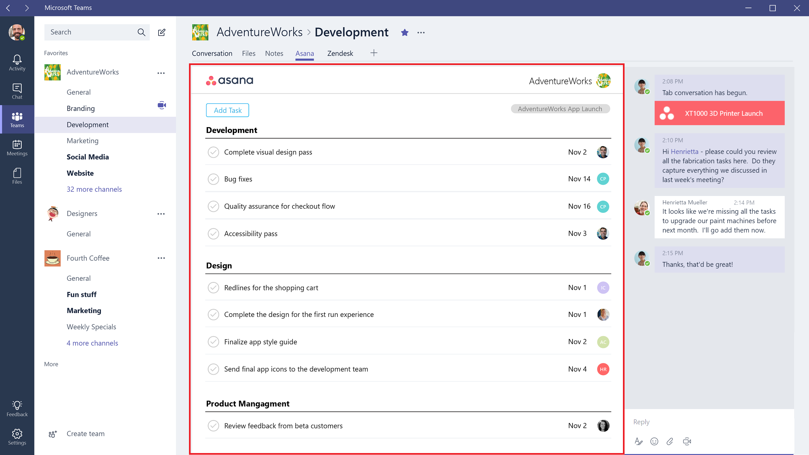

# Create the content for your Microsoft Teams (Preview) tab

When the user visits your tab, Microsoft Teams will load the URL you [provided earlier](createtabconfigui.md) inside an iframe.

## Prerequisites for content displayed in your tab

For your content to display within a Microsoft Teams tab, make sure it meets the [requirements for tab app pages](tabprerequisites.md).

In addition, make sure your content conforms to the [design recommendations](design.md) for Microsoft Teams tabs.

## Samples

Check out our [code samples](samples.md) on GitHub.

## Next steps

* [Update or remove a Microsoft Teams tab](updateremovetab.md)

