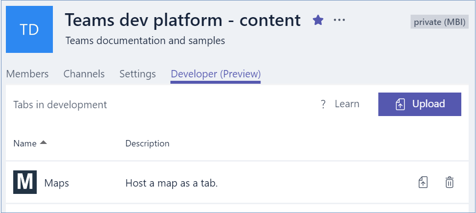
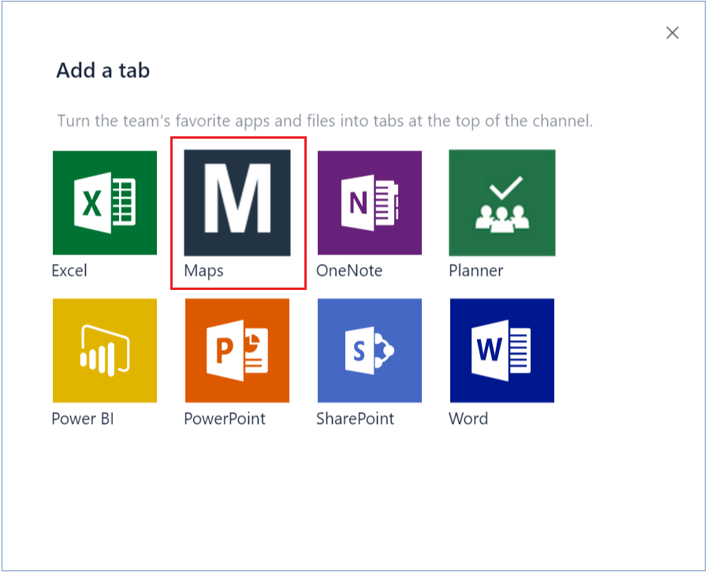

# Create the package for your Microsoft Teams (Preview) tab app

For your tab app to be available within Microsoft Teams, you need to create a tab package and upload it to a team. The tab package is a zip file containing:

- A manifest file named `manifest.json`, which specifies attributes of your app and points to required resources such as app icons and the location of your app configuration page.
- Image files, to be used as icons for your app.  These must be transparent PNGs, with white or light-colored foreground in both small (44 by 44 pixels) and large (88 by 88 pixels) sizes.  (The accompanying background or 'accent color' is specified in the manifest.)

## Creating a manifest for your tab app 

Below is a sample manifest for a simple tab app.

```JSON
{
    "$schema": "https://statics.teams.microsoft.com/sdk/v0.2/manifest/MicrosoftTeams.schema.json",
    "manifestVersion": "0.2",
    "id": "com.example.microsoftteamstabs.maps",
    "version": "0.2",
    "name": "Maps",
    "developer": {
        "name": "Example company",   
        "websiteUrl": "http://www.example.com",
        "privacyUrl": "http://www.example.com/privacy",
        "termsOfUseUrl": "http://www.example.com/termsofuse"
    },
    "description" : {
            "short": "Host a map as a tab.",
            "full": "Host a map as a tab.  Give your tab a name, 
					select Bing Maps or Google Maps, and click save."
    },
    "icons": {
            "44": "maps44.png",
            "88": "maps88.png"
    },
    "accentColor" : "#223344",
    "configUrl": "",
    "canUpdateConfig": true,
    "needsIdentity": false,
    "validDomains": [
        "*.bing.com",
        "*.google.com"
    ]
}
```
**TODO. need to update configUrl with final hosted location of config UI**

The manifest you create for your app must adhere to the manifest schema. For more information, see [Microsoft Teams tab manifest schema](tab_schema.md).

> **Tip** Specify the schema at the beginning of your manifest to enable IntelliSense or similar support from your code editor:
> 
> `"$schema": "https://statics.teams.microsoft.com/sdk/v0.2/manifest/MicrosoftTeams.schema.json",`


## Uploading your tab package to Microsoft Teams

Once you've created your app manifest and image files, compress them into a zip file.

**TODO. reference tab package final hosted location**

Upload this zip file to a team to make your app available as a tab.

1. Create a new team for testing, if necessary.  Click **Create team** at the bottom of the left-hand panel.
2. Select the team from the left-hand panel, select **... (more options)** and then select **View Team**.
	
	
3. Select the **Developer (Preview)** tab, and then select **Upload**.
4. Navigate to your zip file and select it.
	
	


Now, when team members add a new tab to a channel in this team, they will see your app in the gallery of available tabs.

> **Note** To re-upload an updated package, click on 'Replace' icon at the end of the tab's table row.  Don't click 'Upload' again: Microsoft Teams will say the tab already exists.




## Next step

* [Create tab configuration page](createtabconfigui.md)
