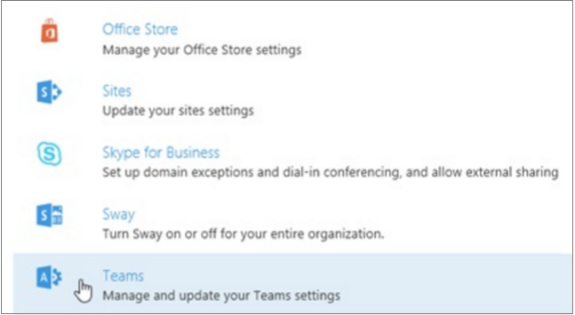
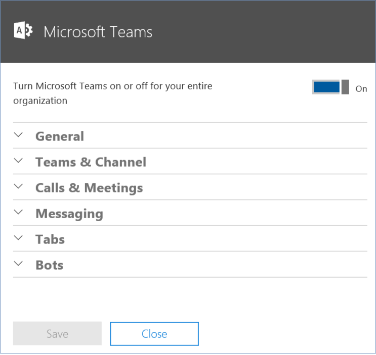
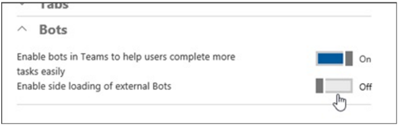

# Setting up Microsoft Teams (Preview) for development

Microsoft Teams is a service within Office 365. To get started developing extensions for Microsoft Teams, you'll need an Office 365 account, and to turn on the Microsoft Teams service for your Office 365 organization. To develop bots, you'll also need to turn on bots and enable side-loading of bots for testing.

## Sign up for an Office 365 trial, or use an existing account

To develop extensions for Microsoft Teams, you need to have an [Office 365 business account](https://products.office.com/en-us/business/compare-more-office-365-for-business-plans). 

This can be one of the following plans:

* Office 365 Midsize Business
* Office 365 Enterprise E1, E3, or E5
* Office 365 Education
* Office 365 Developer 

If you don't currently have an Office 365 for business account, you can sign up for [an Office 365 Developer subscription](https://aka.ms/devprogramsignup) for no charge for one year.

## Turn on Microsoft Teams for your organization

During the preview period, for Microsoft Teams to be available in Office 365 for your organization, someone with administrative rights in your organization must turn on the Microsoft Teams service. If you are working with an Office 365 Developer subscription, then by default you are an administrator of that organization.

Administrators need to use the Office 365 Admin Portal to enable Microsoft Teams for your organization.

1. [Sign in to Office 365](https://login.microsoftonline.com) with your work or school account.
2. Select **Admin** to go to the Office 365 Admin Center.
3. From **Settings**, select  **Services & add-ins**.
4. From the list of services and add-ins, select **Teams**.
 
	

5. On the **Teams** settings screen, toggle Microsoft Teams **On** and then select **Save**.
 
	

## Enable side-loading of your bots

To develop and test bots, you need to enable bots in Microsoft Teams, and also enable bots to be side loaded.

1. [Sign in to Office 365](https://login.microsoftonline.com) with your work or school account.
2. Select **Admin** to go to the Office 365 Admin Center.
3. From **Settings**, select  **Services & add-ins**.
4. From the list of services and add-ins, select **Teams**.
5. On the **Teams** settings screen, toggle both **Enable bots in Teams** and **Enable side loading of external Bots** to **On**, and then select **Save**.

	

For more information on bots, including how to side load them for testing purposes, see [Creating bots for Microsoft Teams](bots.md).

## Next steps

* [Microsoft Teams developer preview](index.md)
	