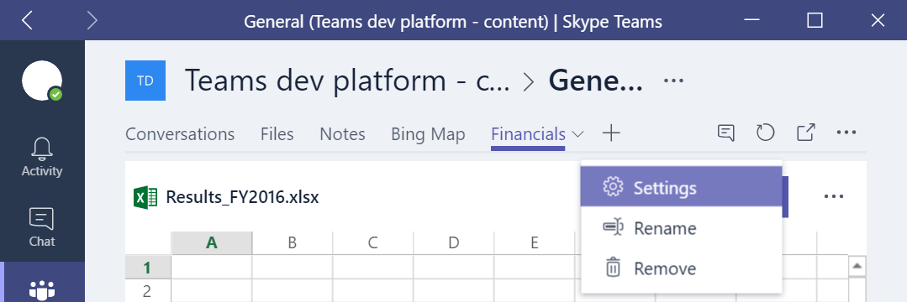

# Update or remove a Microsoft Teams tab

When you create your Microsoft tab app, you can decide whether you want users to be able to update a tab once it's been added to a team, and if you want users to be able to choose what happens to tab content if a tab is removed.

## Updating an existing tab instance

You can enable users to update, or reconfigure, a tab they have already added to a team. When you do so, Microsoft Teams adds a **Settings** selection to the right-click menu for your tab. Selecting this option displays **Update Tab**, which hosts your configuration page.

To enable your tab to be updated, set the `canUpdateConfig` attribute in your tab manifest to `true`. For more information, see [Microsoft Teams tab package schema reference](tab_schema.md).

To support user updates, in your configuration page code call `microsoftTeams.settings.getSettings(<callback>)` after initialization. Once you receive the callback, you can inspect to see if there are existing settings or if this is a new tab. You can then enable your configuration page and continue loading your content in the tab. 

> **Tip** When the user adds a tab, you can set 'customSettings' inside Settings and use this to help you re-instantiate your context if the tab is updated.

## Removing a tab

You can create a page to enable users to select what happens to content when a tab is removed from a team. For example, you might want to give them the option to download, archive, or delete the tab content. This removal page is optional.

To include a tab removal page in your app, specify the `removeUrl` attribute in your tab manifest. For more information, see [Microsoft Teams tab package schema reference](tab_schema.md).

### Prerequisites for your tab removal page 
 
For your tab removal page to display within Microsoft Teams, it must meet the [requirements for tab app UI](gettingstarted.md#prerequisites-for-your-tabs-app-ui).

### Presenting the user with content options upon tab removal

Your code should call `microsoftTeams.settings.getSettings(<callback>)`. Once you receive the callback, you can use these settings to determine the tab content that is being removed.

<!--
Call microsoftTeams.settings.getSettings(<callback>).  Once you receive the callback, you can use these settings to determine the tab content that is being removed.
	Note that when a tab is added, you can set 'customSettings' inside Settings and use this to help you re-hydrate your context when the tab is removed.  This is a string, but you can of course store multiple settings here by serializing or 'stringifying' an object.
-->

Upon page load, enable the **Remove** button immediately by calling `microsoftTeams.settings.registerOnRemoveHandler(function(removeEvent){})` and setting `microsoftTeams.settings.setValidityState(true)`. Microsoft Teams will enable the **Remove** button after five seconds if your tab does not.

Because your tab should enable the **Remove** button immediately, make sure that all the options in your tab removal page have a default selection. 

If your tab removal page requires user context, see [Get user context, locale, or theme information](getusercontext.md). If your app needs to authenticate the user, see [Authenticating your Microsoft Teams tab app](auth.md).

### Processing the content prior to tab removal

Microsoft Teams calls the remove event handler you registered when the user selects **Remove**. At this point, your app should take whatever action(s) the user selected; for example, deleting or archiving content. If you need to perform these actions asynchronously, store `removeEvent`. Microsoft Teams removes the tab after 30 seconds, regardless of your actions.

Finally, call `removeEvent.notifySuccess()` or `removeEvent.notifyFailure()` to notify Microsoft Teams on the outcome of the removal. Currently, Microsoft Teams removes the tab regardless of the outcome.

	
